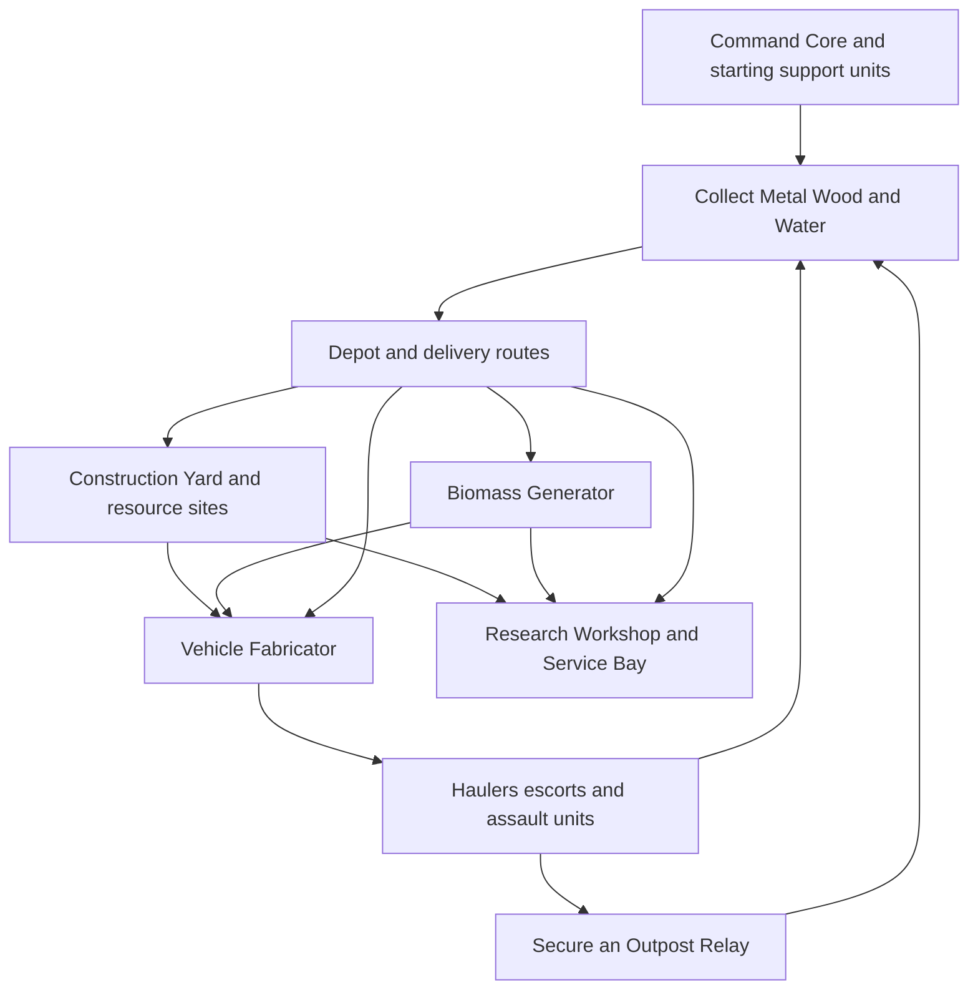

# Common Base Buildings

## Scope

This is the adopted universal roster: every faction can access these common building functions. A functioning main base needs collection, logistics, construction, and manufacturing; every small outpost does not need every building. Metal, Wood, and Water are the accepted primary resources. Functions, material roles, service rules, upgrades, and the opening setup below are adopted. Numeric recipes and rates have initial defaults in [[Initial Economy Tuning]], awaiting actual play.

All new structures and building upgrades require the appropriate card commitment. After completion, passive functions operate automatically; unit batches and discrete research or special projects use cards. Existing units can be ordered and transported without spending another card.

## Foundation and collection

**Accepted placement framework:** Bases use a grid over the actual game world, anchored to a claimed seed point. Base level limits usable spaces; buildings occupy defined footprints and may require attachments or patterns to operate. See [[Base Grids and Connections]]. Existing “build area” references below follow this grid framework; footprints and initial level allowances are defined in that note.

Build materials below are qualitative recipe guidance, not numeric costs. Unlisted resources are not automatically required. Every site needs enabled grid space, a constructor, material delivery, and its build authorization unless supplied at scenario start. Remote extractors require a Relay claim first. Common construction is selected through Civil Works or Resource Works; those cards are always accessible through common requisition.

| Common building | Function and output | Build materials | Prerequisites and placement | Operation and important relationships |
| --- | --- | --- | --- | --- |
| Command Core | Initial build area, small storage for all three resources, basic support-unit production and emergency construction capability | Metal + Wood for a replacement or expansion core | Initial core supplied; later core requires a construction-equipped Worker and Civil Works | Has self-contained starter services. Low-rate Worker, Cargo Trailer, and Construction Rig production prevents dependence on a full factory. No free material income |
| Construction Yard | Additional constructor servicing and common construction/upgrade capacity | Wood-heavy + Metal | Core or established outpost area | Produces Workers and common attachments through Produce Support; power enables its normal rate. Constructors travel to sites and perform building work independently of vehicle factory bays |
| Resource Depot | Stores Metal/Wood crates and Water tanks; dispatches deliveries and provides forward unloading | Wood + Metal | Accessible cargo lanes; may sit at an extraction site | Basic storage and unloading need no grid power. Throughput and capacity are explicit. Multiple depots shorten routes and distribute loss risk |
| Metal Extractor | Converts a local deposit into collected Metal | Metal + Wood | Surveyed valid deposit; connected delivery route | Slow baseline extraction without power; powered drilling jobs use Water for increased output. Finite source reserve and output buffer |
| Timber Yard | Organizes harvesting and outputs Wood | Wood + Metal tools | Harvestable woodland or timber salvage within work reach | Basic harvest without power; optional powered processing upgrade. Clearing changes cover and eventually requires another harvest location |
| Water Station | Collects usable Water into a local tank | Metal + Wood | River/lake intake, spring, or valid accessible groundwater | Slow independent collection; power increases pumping rate. Tanker access and source yield limit useful output |

Field scavenging of loose Metal, timber, and stored Water is a unit capability, supported by the Core and haulers. The resource buildings improve dependable throughput; they are not prerequisites for picking up the first materials.

## Industry and sustainment

| Common building | Function and output | Build materials | Prerequisites and placement | Operation and important relationships |
| --- | --- | --- | --- | --- |
| Biomass Generator | Supplies connected buildings with power capacity | Metal + Wood | Core/outpost service area; accessible Wood delivery | Burns Wood according to served load. Independent startup; no powered building prerequisite. Supply interruption suspends dependent industrial work |
| Vehicle Fabricator | Produces common scout, cargo, support, and assault hovercraft | Metal-heavy + Wood + commissioning Water | Completed Construction Yard, power service, delivered materials, clear exit lane | Production card + unit recipe; Metal for chassis, Water per job, factory bay time. Existing units continue operating if the factory is lost |
| Service Bay | Repairs vehicles and refits supported equipment | Metal + Wood | Powered service area; vehicle approach space | Repair consumes Metal and process Water according to damage. Repair orders are free; installing a new capability uses a refit card. Competes with new production for supplies |
| Research Workshop | Performs card-authorized common upgrades, scans recovered assets, and establishes known compatible uses | Metal + Wood + commissioning Water | Construction Yard, power, supplied work bay | Projects consume defined Metal/Water and real time; no separate science currency. Results unlock specific options rather than issuing unlimited cards |
| Air Hangar | Builds and services common aircraft | Metal-heavy + Wood + commissioning Water | Vehicle Fabricator capability, power, clear approach/launch space | Aircraft production cards, Metal and Water recipes, separate hangar bays. Common-access later branch; not needed for a ground-only opening |

The Workshop supplies ordinary analysis and research capacity. Rare buildings add specialized uses; they should not monopolize every world-object interaction.

## Security and expansion

| Common building | Function and output | Build materials | Prerequisites and placement | Operation and important relationships |
| --- | --- | --- | --- | --- |
| Sensor Mast | Local detection and threat alerts | Metal + Wood | Useful sightlines, powered service area | Tracks observable threats within defined sensing rules; no global omniscience. Supports convoy defense and gives opponents a target for concealment |
| Defense Tower | Fixed defense of routes and facilities | Metal-heavy + Wood | Supplied powered site, useful firing arc | Basic energy weapon uses power without another ammunition currency. Range and line of sight matter; mobile forces can bypass it |
| Outpost Relay | Authorizes a limited remote development area and extends local services | Metal + Wood | Valid surveyed site outside hostile control; establishment card | Includes a small depot and independent beacon. Requires its own generator for industry. Does not teleport goods or guarantee military control of its area |

Habitat, food, civic stability, dedicated ammunition works, and diplomacy buildings are deferred. They may become appropriate when inhabitants and politics have defined roles; adding them now would introduce unsupported mandatory systems. The baseline has autonomous production and no crew/population currency; future civilian systems must be designed explicitly.

## Core dependency loop

Construction and vehicle production can run simultaneously. Their separate work capacity avoids a single queue blocking all recovery, while shared Metal, Wood, Water, and cargo routes create real tradeoffs. This adapts the patterns recorded in [[Strategy Building Research]].

## Viable opening

1. Start with a deployed Core, one Worker with Construction Rig, one Worker with Cargo Trailer, one Scout, and a material reserve. The Core has small storage and support production from the start.
2. Use the curated opening hand and common requisition rule in [[Cards and World Time]]. Later unused cards discard normally.
3. Scout nearby sources and collect loose material. Establish the most urgent resource site and a useful Depot; the other sites follow according to reserves and terrain.
4. Build a Generator and Construction Yard in either order. Neither requires the other to exist.
5. Establish a Vehicle Fabricator, then commit a reinforcement or cargo batch while constructors continue infrastructure work.
6. Add repair and sensing, secure a remote source with an Outpost Relay, and develop research or air capability according to the situation.

The starting reserve and bootstrap arithmetic are in [[Initial Economy Tuning]]; they cover the listed opening structures, with fuel delivery required before sustained load. Three-resource availability alone is insufficient if hauling takes longer than the reserve lasts.

## Damage and recovery defaults

Power loss suspends powered work; extraction retains a slow independent mode. Full depots pause incoming jobs or redirect haulers rather than deleting cargo. Losing a Core does not erase cards or surviving units; a surviving constructor can rebuild using Civil Works and delivered materials. Elimination follows the recovery-path rule in [[Worker Attachments and Couplings]]; detaching a rig does not by itself eliminate a faction. Other scenario objectives may define different defeat rules.

Salvage returns part of invested material under explicit recovery rules. Destruction of a factory does not refund already consumed resources automatically. Jobs must distinguish unspent cargo from completed construction.

## Common upgrades and machine-readable rules

Use upgrade cards to add capacity, throughput, resilience, or efficient operation to the existing function. A Depot gains storage or loading bays; an Extractor gains powered drilling; a Fabricator gains another work bay. Common upgrades remain common; a higher building level is not automatically a higher rarity.

Each building definition needs: identifier, rarity property, level, build card, material recipe, build work, prerequisites, footprint, placement rules, storage, work bays, power supply/demand, active consumption, supported jobs, enabled capabilities, salvage, and failure behavior. Numerical prices and throughput are in [[Initial Economy Tuning]]; layout defaults are in [[Base Grids and Connections]]. Neither has yet been validated in play.

Inspecting a building should explain a concrete blockage such as “Water assigned; tanker arriving” or “Generator has no Wood.” The same predicates govern human and AI actions.

## Example emergent pressure

A base's Generator consumes the same Wood needed for a forward Depot. The nearby forest is exhausted, so a hauler crosses exposed ground to another Timber Yard. An opponent intercepts it. The player can escort the next load personally, reduce industrial activity to stretch fuel, or spend the remaining Wood on a closer supply foothold. The situation follows from stocks, consumption, geography, and decisions.

See [[Core Resources]], [[Cards and World Time]], and [[Rare Building - Coupler Foundry]].

## Upgrade behavior

A common Upgrade Facility operation adds a declared capability to a compatible building: Depot storage or loading throughput; Extractor powered drilling; Yard constructor servicing throughput; Fabricator a second work bay; Service Bay faster repairs; Sensor Mast improved detection. Each definition must declare a maximum level and resulting power demand. Existing buildings keep their footprint for these first upgrades; an extension needing more cells is a separately placed module.

Prerequisite structures unlock construction capabilities for the faction when completed. Losing a prerequisite does not revoke that knowledge or disable downstream factories. Operational dependencies such as power, physical ports, access, materials, and the Foundry modules remain live checks. This keeps the dependency tree from becoming an unexplained shutdown cascade.

An Outpost Relay uses the same level and grid rules as a Core, but has no support-unit factory. Upgrade Facility can replace it with a Core at the same seed when the Core footprint and entrance are free. No land or inventory is duplicated by that replacement.

Initial quantitative defaults: [[Initial Economy Tuning]].

## Worker role terminology

Constructor means a [[Basic Unit Roster|Worker]] with a locked, working Construction Rig; hauler means a Worker with Cargo Trailer. These are equipment configurations of one chassis. Orders requiring a role wait for its physical attachment and valid coupling. See [[Worker Attachments and Couplings]] for acquisition, docking, damage, and recovery.

