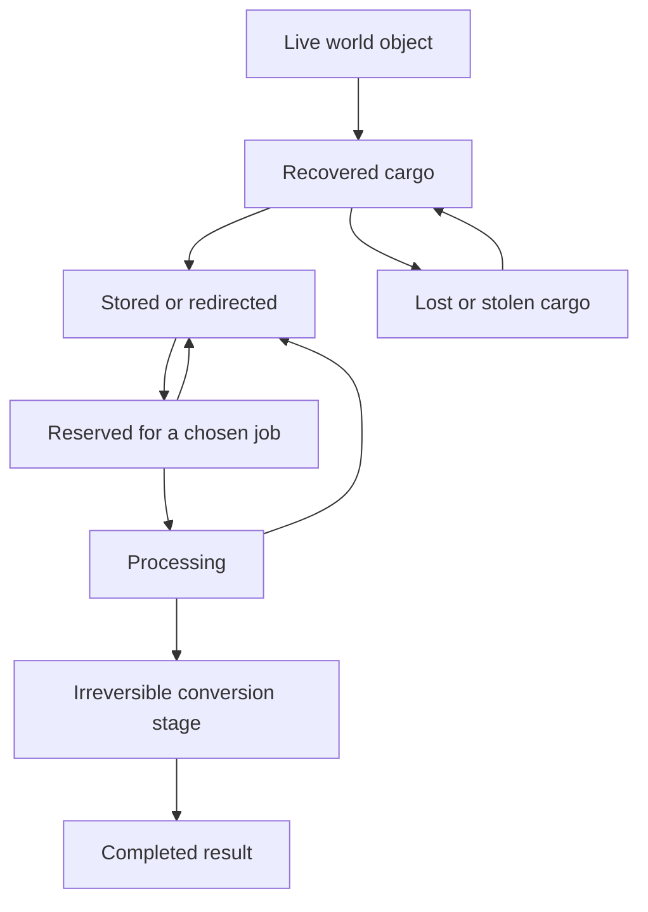

# World Assets and Outcome Resolution

## Object, custody, use, result

A dark matter coupler is a physical object with compatible uses. It does not become an owned legendary card merely because someone picks it up. Its use determines the completed result. This is the creator-confirmed reference for the intended emergent experience.

Track object identity, location, condition, known properties per faction, custody, reservation, chosen recipe, processing state, and final disposition separately. Recovery grants physical custody, not every potential benefit. Cards can also be earned directly through explicit contracts; not all collection entries must previously exist as loose objects.

## Lifecycle

Before the declared conversion stage, cancelling releases the object where it is, loses consumed work materials, and permits another use. Cancellation does not refund the card or phase points. The baseline places the conversion stage at final successful completion. Recipes may later define earlier irreversible stages only if explicitly shown before commitment.

Power loss, missing modules, or blocked service suspends work and preserves progress; resuming the same job requires no second card. Changing the recipe cancels the old operation and requires new authorization. Destruction ends the job. An unconverted coupler survives as recoverable cargo under its durable-component rule; ordinary stock uses declared salvage fractions. Component invulnerability is not a global rule for all cargo.

## Completion contract

`available uses = known compatible recipes satisfying current prerequisites`

At completion, recheck facility function, custody/reservation, exclusive input, recipe, and output uniqueness. Apply input disposition and result together, once. A result cannot be secretly rerolled. If readiness fails, suspend the operation; if the target no longer exists, cancel it with its defined recovery behavior.

The coupler has two adopted recipes:

- **Foundry synthesis:** Transform the coupler into the specified legendary card. The coupler's identity becomes spent provenance; it no longer exists as recoverable cargo. The card enters collection.
- **Generator installation:** Install the coupler as a tracked component, granting 25% lower Wood use for the same served power. This initial tuning does not stack; one coupler slot per Generator. No card reward is also granted.

A constructor may remove an installed coupler through an Upgrade Facility operation while the Generator is off. Completion removes the benefit and releases the same coupler as cargo. Destroying that Generator drops the installed coupler as recoverable salvage and removes its benefit. Recovering it never restores the destroyed Generator or grants both outcomes simultaneously.

## Information and consequences

A basic scan identifies a component and advertised compatibility tags. A Workshop can reveal additional authored recipes through Research Project; it never invents a different result after commitment. The player sees known uses, missing facilities, input consumption, time, and completion result. Opponents use only discovered information.

A contract tracks its need independently of a particular object. If one coupler is used elsewhere and another valid substitute exists, the contract can continue until its deadline. If no eligible solution remains, it closes with an explained consequence. Discovery alone does not require every faction to know the object's location.

Count one live object with mutually exclusive uses as one opportunity. Count realized cards and installed components separately, linked to that opportunity's provenance. See [[Procedural Content and Rarity]] and [[Rare Building - Coupler Foundry]].
