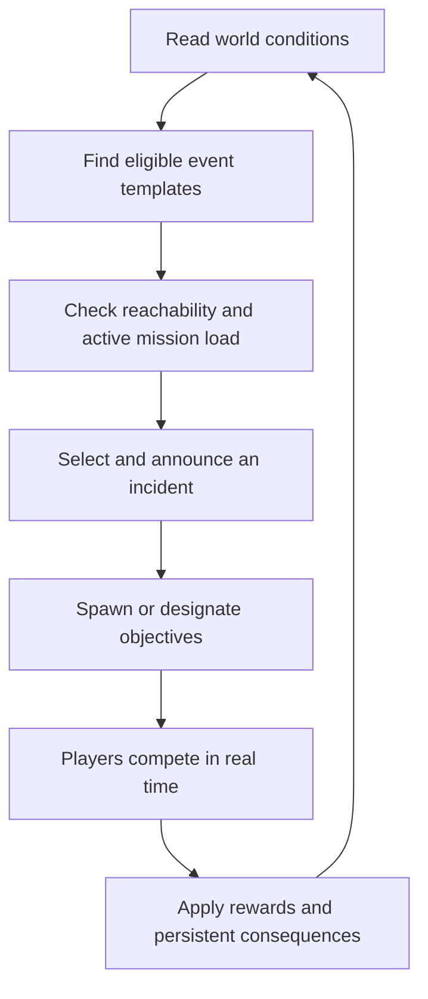

# World Events and Objectives

## Intent

Scenarios have substantial objectives such as conquering territories or harvesting a resource threshold. Each phase evaluates contextual world events under an active-incident budget. These create missions that feed back into bases and conquest. Missions can have timers, transferable objectives, and opponents pursuing the same rewards.

## Event grammar

**Existing condition → incident → physical objective → competing interests → resolution → lasting change.**

The generator first checks eligible locations and conditions, then chooses among valid incidents. It should never select an earthquake-damaged mine without an eligible mine, or a delivery destination that no longer exists.

Events use weighted eligibility, cooldowns, and the active-incident budget in [[Procedural Content and Rarity]]. A phase can produce a developing warning or no new event when no suitable incident fits.

## Worked example: generator part

1. An established cyborg enclave has a failing generator and offers a repair contract.
2. A known wreck or depot contains a compatible replacement. The destination and access route are validated before the offer appears.
3. Interested factions receive the same public offer; their map knowledge may differ.
4. The part is physical cargo. A hovertruck carries it; escorts defend it; direct piloting helps cross difficult ground quickly.
5. If the carrier is disabled, the part can be recovered. Track physical custody separately from an earned card or completed upgrade; carrying the part does not itself complete either outcome.
6. Delivery before the deadline restores the enclave and grants the promised reward. Failure changes local power or services rather than silently deleting the story.

Each contract states its reward, deadline, compatible inputs, and whether it is first-completer-only. Cargo has explicit durability; a coupler survives as salvage. Custody is revealed only through sightings or a specifically announced tracking property, not universal carrier omniscience. Negotiated delivery rights are deferred.

**Accepted refinement:** A recoverable asset can support competing uses, with the recovering player's actions determining the result at objective completion. A dark matter coupler might become a legendary card through one valid use, or a building upgrade component through another. The fixed repair contract above is one possible use, not the full identity of the object. See [[World Assets and Outcome Resolution]].

## Event families

| Event | Eligibility | Contested action | Lasting result |
| --- | --- | --- | --- |
| Satellite crash | Valid crash terrain and scenario-supported satellite activity | Recover modules from scattered debris | Research options or valuable cards |
| Mine collapse | Operating mine and eligible hazard conditions | Rescue workers, deliver equipment, or seize abandoned material | Changed output, trust, or access |
| Hidden city discovered | Unrevealed settlement on the generated map | Reach it and establish contact | New services, routes, or faction relationship |
| Stranded convoy | Existing logistics route and a plausible breakdown or attack | Repair, escort, capture, or salvage | Resource delivery succeeds or changes hands |
| Reactor instability | Vulnerable powered facility | Stabilize or evacuate before failure | Facility saved or local terrain/access altered |
| Signal triangulation | Suitable signal sites and unexplored reward location | Hold several listening positions | Reveal a cache rather than spawn arbitrary loot in view |

## Scenario objective variety

- **Territory:** Control a network of strategic sites for a sustained interval.
- **Industry:** Extract and deliver a resource quota; specify whether stockpiled or cumulative resources count.
- **Evacuation:** Bring enough civilians or cargo to departure sites before conditions deteriorate.
- **Restoration:** Repair a regional power or transit network whose sections are contested.
- **Expedition:** Find and recover multiple pieces of a dispersed artifact or machine.
- **Influence:** Secure commitments from several settlements through services and defense.
- **Asymmetric race:** Pursue publicly explained faction-specific goals with intersecting locations and resources.

Give each scenario one clear primary victory condition. Secondary opportunities change how to reach it. Match objectives can be symmetric even when events offer different opportunities to factions based on position.

## Fairness and emergence

Prefer combinations of a few dependable verbs—carry, escort, hold, scan, repair, extract—over large numbers of bespoke scripts. Track event provenance so the player can understand why an incident happened. Avoid invisible catch-up penalties; any deliberate pressure adjustment needs a clear design decision.

See [[Cards and World Time]], [[First Playable Scenario]], and [[Command and Opponent AI]].

## Adopted interruption and consequence rules

A contract offer reserves its promised finite reward. Delivery is a real unload/interaction operation at a surviving valid destination. Competing attempts share one objective identity, so only one can complete a first-delivery contract. Completion consumes or installs the stated input and applies its consequences together.

If an objective loses eligibility after announcement, update its status with the cause. Another compatible component can satisfy a need if the contract accepts that type; a contract tied to a specific artifact cannot silently substitute another. Damaged generators lose output, exhausted forests cease yielding, and interrupted facilities retain their documented recovery routes. Event flavor describes these state changes rather than inventing unrelated outcomes.
