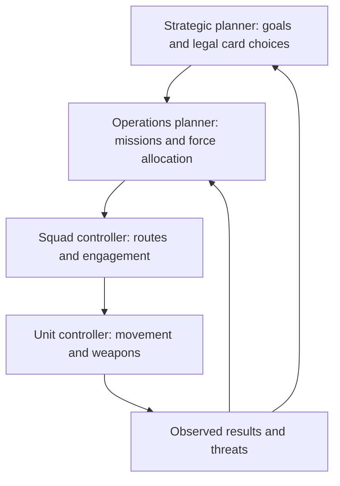

# Command and Opponent AI

## Intent

The world view is real-time 3D with an RTS-style military interface. Players select units, create groups, assign formations and rally points, and issue follow, attack, guard, and patrol orders. They can assume direct control of any friendly unit. Buildings expose production, resource, upgrade, and dependency information; building actions remain card-driven.

## Control contract

Strategic orders express intent. Squads handle navigation, spacing, target selection, and basic self-preservation. Direct control temporarily overrides a unit's steering and weapon inputs. Returning to command view should make the unit's next behavior explicit: resume its order, hold position, or rejoin its squad.

Switching among friendly controllable units is unrestricted by base power or communications range. Releasing a unit resumes its previous valid order; if that order is no longer valid, it holds safely and reports the blockage.

## Interface

- **Command view:** Unit selection, orders, formations, squad status, resource flows, mission markers, and card targets over the actual world.
- **Direct view:** Vehicle or character controls, squad orders, local objectives, and concise strategic alerts.
- **Building inspection:** Inputs, outputs, capacity, active jobs, dependencies, upgrades, and reasons for blocked cards.

Selecting a card highlights legal targets and explains unmet prerequisites. Placing a build card previews the footprint, access, and cost before commitment. Mission cargo and active operations retain consistent markers across both camera modes.

## AI responsibilities

These layers share operation records such as “build extractor at deposit, protect builders, then defend output.” This lets strategic plans produce contextual ground behavior. A destroyed builder or captured cargo triggers replanning rather than leaving a stale command running.

The strategic opponent evaluates legal cards against scenario progress, resource needs, threats, and opportunity costs. The operations planner allocates units and checks feasibility. Squad controllers make local decisions. Unit controllers execute physics-aware movement and combat.

## Same rules, different decisions

Use one authoritative card resolver for human and AI commitments. Both must satisfy costs, target validity, production capacity, and timing. AI decisions receive only information available under the chosen visibility rules; internal world data must not accidentally become strategic knowledge.

The AI faction has no exclusive commander-unit bonus. Its units obey the same movement and weapon limits as player-controlled units. Difficulty varies planning quality and reaction delay, with no hidden resources or unrestricted map knowledge in the baseline.

## Questions for real play sessions

Can squads complete a basic order while the player pilots elsewhere? Does the opponent defend a committed operation, abandon an infeasible one, and pursue a visible contested reward? Can a player identify why an AI card play was legal? Can a hovertruck navigate the same mission routes the player can use?

These are observations to make in an actual playable build, not claims that an implementation exists.

## Planning with grids, cargo, and card phases

The planner evaluates legal grid patterns, reserves expansion cells, leaves usable vehicle lanes, and accounts for delivery time and generator fuel. A legal footprint alone does not count as a viable factory plan. It values each known component use against current base shortages, objective progress, available facilities, and opponent pressure.

Operations expose states: planned, awaiting delivery, working, suspended, complete, cancelled. The AI assigns escorts to actual deliveries, prioritizes threatened modules, and replans when a component changes custody. Phase pressure changes which legal card commitments it prioritizes; it cannot submit a card retroactively after its window expires.

The command interface displays the same operation state and dependencies. Direct view supports quick cards and concise warnings without pausing. Hand management may happen while driving; it must not automatically discard inputs or change a vehicle's order merely because a panel opens.

## Modular unit control

The basic chassis are [[Basic Unit Roster|Assault, Scout, and Worker]]. Worker role commands depend on locked functional equipment. AI docking follows the same alignment, latch time, hinge limits, and load rules as manual driving. A pending construction order survives losing a rig but pauses until a valid replacement is attached. Convoy routes account for articulated trailers, and a module is not teleported to a Worker when reassigned. See [[Worker Attachments and Couplings]] and [[Common Vehicle Weapons]].

