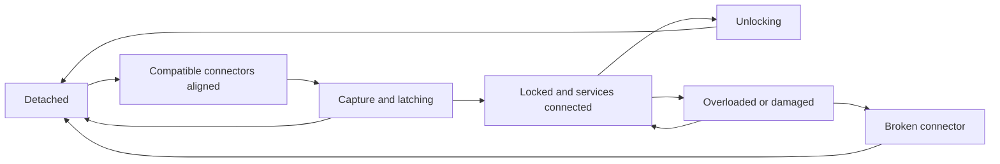

# Worker Attachments and Couplings

[[Units and Equipment Index|Units and Equipment]]

## Physical object model

A Worker, its front tool, its rear module, and its cargo are distinct tracked objects. Each attachment has identity, position, orientation, condition, socket compatibility, mass/load, power demand, work capability, and current custody. Its connector has separate latch and structural state. Owning a production card does not mean a module is physically available at the truck.

Detached rear modules settle on support skids/stabilizers. Coupled modules use assisted hover suspension powered by the Worker. Detached cargo remains where the module is parked; it does not enter global storage. Module assistance supports its own motion and tools, not the base power grid.

## Common attachment set

All recipes below are initial tuning. M = Metal, W = Wood, H = Water; work time is standard manufacturing time, not docking time.

| Attachment | Socket | Function | Storage | Recipe M/W/H; seconds |
| --- | --- | --- | --- | --- |
| Cargo Trailer | Rear articulated | General crates and sealed Water containers | 60 bundles total | 5/0/2; 15 |
| Construction Rig | Rear articulated | Construction manipulator, claim beacon deployment, demolition, component installation | 20 bundles | 10/0/2; 15 |
| Mining Head | Front articulated/tool lock | Mobile Metal extraction; 3 bundles/minute baseline | 10-bundle output buffer | 12/0/2; 20 |
| Forestry Head | Front articulated/tool lock | Mobile timber cutting and collection; 5 bundles/minute | 10-bundle output buffer | 10/0/2; 20 |
| Pump Head | Front articulated/tool lock | Collect usable Water at 4 bundles/minute into a locked Cargo Trailer | No independent tank | 8/0/2; 20 |
| Recovery Winch | Front articulated/tool lock | Pull/reorient one loose compatible module at low speed | None | 10/0/2; 20 |

A bare Worker costs 20 Metal and 3 Water, with 30 seconds manufacturing work. Chassis + Trailer is therefore 25 Metal/5 Water and 45 seconds; chassis + Construction Rig is 30 Metal/5 Water and 45 seconds, preserving the earlier opening recipes. Docking adds actual physical time after manufacture.

Mobile tools draw from the same finite world sources as fixed extractors. Harvest reservations prevent counting one resource twice. A fixed building provides higher sustained output and storage; the tool can relocate without a construction card. Operating a manufactured tool is a free unit order. Powered Metal extraction's Water requirement applies to the fixed enhanced mode, not as an undeclared mobile cost.

Front tool and rear module may coexist if their compatibility and envelope checks pass. A Mining or Forestry Head can transfer output into the locked Cargo Trailer through the Worker's transfer system; transfer has a finite rate of 30 bundles/minute. Without a trailer, fill the tool buffer and then stop until it is unloaded. A Construction Rig does not accept automatic mobile harvesting output in the baseline. Tool use requires a stable parked vehicle, with front articulation mechanically braced during work.

## Connection sequence

1. Select the actual module and desired socket. Check custody/access, compatibility, free space, and current connector condition.
2. Drive the Worker toward the module's mating connector. Rear attachment usually means reversing into it. The module can be repositioned by a Recovery Winch or by ordinary physics.
3. Enter the capture envelope at low relative speed and angle. Initial tuning: within 0.4 metres, 10 degrees, and 0.5 metres/second relative speed.
4. Maintain valid alignment for 2 uninterrupted seconds. The capture guide has limited force; it cannot teleport a heavy trailer through an obstacle or pull a distant connector into place.
5. Close the latch, enable constrained articulation, and connect power/data. Only then do attached work capabilities become available.

Moving outside the capture envelope or losing an eligible socket resets latching. Targeting reserves a docking attempt against simultaneous latch claims; actual lock grants custody of unowned equipment. A reservation is short-lived intent, not immunity from enemies physically moving or damaging the module.

## Connector state and strength

Track these separately:

- **Latch progress:** Completion of the connection procedure, not ongoing health.
- **Integrity:** Damage state of the connector, initially 100% when undamaged.
- **Rated capacity:** Design limits for draw/push load, sideways load, and angular excursion.
- **Current load:** Demand from cargo mass, acceleration, impacts, slopes, tool reaction, and articulated motion.
- **Articulation:** Current angle, normal range, and hard-stop contact.

Use a gameplay load ratio: `load ratio = largest applicable load demand / effective capacity`, evaluated per declared connector limit. Effective capacity is the limit reduced by integrity and any explicit modifier. This is a game-system definition, not a finalized physics-solver formula.

Zero integrity immediately means a broken connection; do not divide by zero when evaluating capacity. Below capacity, normal motion does not cause arbitrary timed decay. Sustained overload accumulates damage, and hard impacts can cause immediate damage. At zero integrity the connector breaks and detaches. Approaching the hinge limit creates visible resistance and overload risk rather than unlimited rotation. Initial rear yaw range is ±60 degrees; other angular limits and load curves need real physics tuning.

The rear joint permits trailer articulation. The front joint uses an articulation mode for travel/alignment and a braced mode for active tool work. A tool cannot exert full work force while its brace is open. The brace is not an extra attachment slot.

Warning stages report approaching limit, overload, and imminent failure. Condition affects capability without silently deleting the module. Repairing a chassis does not automatically repair an unrelated damaged trailer or connector.

## Detach, damage, and recovery

Normal detach requires stopped tool work, low speed, and a stable supported module. The Worker opens services, releases the latch over 1 second, and backs away. A free emergency-release command detaches immediately and preserves current momentum; it can damage equipment or spill vulnerable cargo through the ordinary collision rules. It creates no explosion by itself.

A broken connector needs repair before locking again. A Service Bay or appropriately equipped Construction Rig can repair it using physical Metal. Initial tuning: restoring 25 integrity costs 2 Metal and 10 seconds of work, proportionally rounded; maximum integrity is 100. Repair cannot upgrade the connector's original rating.

An intact detached module can be recovered or stolen. Controlled base equipment is not claimable simply by touching it: an enemy must complete a visible 5-second salvage override at close range on a detached module, interrupted by movement away or hostile damage. This changes module custody; docking still needs physical alignment. A locked module cannot be overridden until disconnected. Base capture transfers parked module custody along with local equipment, but not attached modules on surviving enemy Workers.

Destroyed Workers leave surviving modules as separate recoverable objects; module and cargo damage use their own collision/damage outcomes. No default rule both awards Metal salvage for a module and leaves that same module intact. Exceptional cargo such as a coupler retains its stated durability and exclusivity rules.

## Acquisition and card boundary

Produce Support can fabricate a chassis, a common module, or a defined package. Salvage, trade contracts, and rewards can supply intact attachments. Coupling an existing compatible module is a free physical action; new manufacture or an upgraded connector kit requires card authorization and materials.

Standard couplers support later variations: faster latching, wider capture tolerance, greater load rating, armour, shock damping, or improved articulation. These must be explicit module/connector properties with costs and tradeoffs. The baseline uses one standard connector class and does not invent rare statistics yet. These upgrade dimensions are reserved content hooks, not free player-adjustable sliders.

## AI and direct-control experience

Attach Module orders find a reachable approach, align, brake, wait for lock, and verify capability before starting the next task. Failure reports blocked approach, incompatible socket, module moved, damaged connector, or insufficient support. AI cannot bypass the latch timer. Convoy routing accounts for the whole articulated envelope and cargo load.

Direct view shows alignment guides, closure progress, rear camera access, lock confirmation, integrity, and overload warnings. Command view distinguishes chassis and attached equipment while allowing the assembly to be selected together. A route can be assigned before coupling; execution waits for the required locked role.

## Recovery and elimination refinement

Detaching the only Construction Rig does not eliminate a faction. A Core or Relay always preserves its recovery foothold. Without either, a surviving Worker preserves recovery while it has or can reach a usable Construction Rig and obtain the materials for a new claim. A faction with only combat vehicles cannot rebuild. If a rig is damaged, accessible repair capability counts toward recovery; a bare Worker with no accessible usable/repairable rig does not.

For the first scenario, evaluate elimination only when no Core/Relay remains and no Worker has a physically reachable owned or unowned recovery path to a functioning Construction Rig and required claim materials. Enemy-locked equipment does not count as guaranteed recovery. Record the reason before ending the scenario; avoid per-frame defeat checks during a legitimate coupling or repair operation.

## Emergent example

A loaded trailer follows a Worker down a ridge. Hard turning overloads its damaged rear connector. The player can slow down, lighten the load, or risk separation to outrun an Assault. If it breaks, the Worker may escape while the trailer and its coupler cargo remain contested. A second Worker can align, lock, and recover the exact same trailer; the cargo's potential uses have not yet become rewards.

See [[Basic Unit Roster]], [[Core Resources]], [[World Assets and Outcome Resolution]], and [[Common Vehicle Weapons]].

The bare Worker's 5-bundle recovery pallet is available only with an empty rear socket. Empty or transfer that pallet before latching a rear module; it is not extra capacity stacked on a Trailer or Construction Rig.

