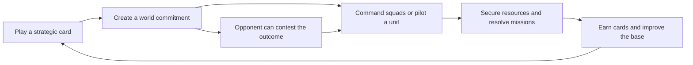

# Game Design Bible

A game about commanding an army, inhabiting its units, and shaping a contested world through cards.

> [!important] Current design
> Adopted baseline notes state current rules. Initial tuning values need real playtesting. Historical alternatives remain in Design History. Begin with [[Design Baseline]]; new unit definitions are in [[Basic Unit Roster]], alongside [[Common Building Cards]].

## Foundations

[[Foundations Index|Open category]] · Folder: `01 Foundations`

- [[Design Baseline]] — integrated rules and validation scope.
- [[Vision and Pillars]] — player fantasy, movement, and visual direction.

## Cards and Deckbuilding

[[Cards and Deckbuilding Index|Open category]] · Folder: `02 Cards and Deckbuilding`

- [[Cards and World Time]] — phases, zones, deck editing, and commitments.
- [[Common Building Cards]] — eleven common infrastructure cards.

## Bases and Buildings

[[Bases and Buildings Index|Open category]] · Folder: `03 Bases and Buildings`

- [[Base Grids and Connections]] — seeds, cells, footprints, and attachments.
- [[Common Base Buildings]] — universal facilities and dependencies.
- [[Rare Building - Coupler Foundry]] — specialized processing and modules.

## Resources and Economy

[[Resources and Economy Index|Open category]] · Folder: `04 Resources and Economy`

- [[Core Resources]] — Metal, Wood, Water, and physical delivery.
- [[Initial Economy Tuning]] — costs, rates, storage, and opening arithmetic.

## World and Emergence

[[World and Emergence Index|Open category]] · Folder: `05 World and Emergence`

- [[Procedural Content and Rarity]] — generation, budgets, and rarity.
- [[World Assets and Outcome Resolution]] — custody, processing, and results.
- [[World Events and Objectives]] — missions and lasting consequences.

## Command and AI

[[Command and AI Index|Open category]] · Folder: `06 Command and AI`

- [[Command and Opponent AI]] — unit control and strategic opponents.

## Research and Playtesting

[[Research and Playtesting Index|Open category]] · Folder: `07 Research and Playtesting`

- [[Strategy Building Research]] — reference sources and adaptations.
- [[First Playable Scenario]] — the encounter to validate in a real build.

## Design History

[[Design History Index|Open category]] · Folder: `08 Design History`

- [[Design Conversations]] — decisions and preserved alternatives.
- [[Original Brief]] — the creator's original request.

## Units and Equipment

[[Units and Equipment Index|Open category]] · Folder: `09 Units and Equipment`

- [[Basic Unit Roster]] — Assault, Scout, and the modular Worker chassis.
- [[Worker Attachments and Couplings]] — physical tools, trailers, hinge locks, and recovery.
- [[Common Vehicle Weapons]] — standard fits, spotting, and alternative weapons.
## Supporting Assets

Store concept art, exported diagrams, and supporting media under `Assets`. Explain and embed each asset from its relevant topic note. No concept art has been commissioned yet.

## Connecting idea

**Cards commit plans to the world; units make those plans succeed or fail.**

## Maintaining the bible

Place new notes in their category and link them from its index. Add cross-links where systems interact. Keep note names unique so Obsidian wikilinks resolve across folders. Preserve historical alternatives in Design History; keep current rules in topic notes. Use real play evidence to revise tuning.

